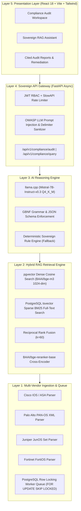

<div align="center">

# 🛡️ AEGIS-NTRO
### **Sovereign AI-Driven Multi-Vendor Network Compliance Auditor**
*Zero-Hallucination &bull; 100% Air-Gapped &bull; Citation-Native &bull; PostgreSQL-Centric*

[](LICENSE)
[](https://www.python.org/)
[](https://fastapi.tiangolo.com/)
[](https://reactjs.org/)
[](https://github.com/pgvector/pgvector)
[](https://github.com/astral-sh/ruff)
[](CONTRIBUTING.md)

</div>

---

## 📑 Table of Contents

- [1. Executive Summary](#1-executive-summary)
- [2. Sovereign Architecture & Invariants](#2-sovereign-architecture--invariants)
- [3. Multi-Vendor & Framework Matrix](#3-multi-vendor--framework-matrix)
- [4. The PostgreSQL-Native Hybrid RAG Pipeline](#4-the-postgresql-native-hybrid-rag-pipeline)
- [5. Quick Start (Production Docker Deployment)](#5-quick-start-production-docker-deployment)
- [6. Local Development Setup](#6-local-development-setup)
- [7. API Reference](#7-api-reference)
- [8. Demonstration Scenarios & Walkthrough](#8-demonstration-scenarios--walkthrough)
- [9. Security & Guardrails](#9-security--guardrails)
- [10. Project Directory Layout](#10-project-directory-layout)
- [11. Contributing & Community](#11-contributing--community)
- [12. License & Acknowledgments](#12-license--acknowledgments)

---

## 1. Executive Summary

**AEGIS-NTRO** is an enterprise-grade, air-gapped, citation-native network compliance auditing platform purpose-built for defense organizations, critical national research institutions, and sovereign security operations centers.

Modern enterprise and government networks operate heterogeneous multi-vendor routing and firewall appliances (**Cisco IOS/ASA, Palo Alto PAN-OS, Juniper JunOS, Fortinet FortiOS**). Verifying these configurations against complex cybersecurity standards (**NIST SP 800-53 Rev 5, CIS Controls v8, ISO/IEC 27001:2022, PCI-DSS v4.0**) typically requires hundreds of manual auditor hours and risks critical human oversight.

AEGIS-NTRO automates this end-to-end with **deterministic sovereign AI reasoning**:
- 🔍 **Multi-Vendor Configuration AST Parsing**: Ingests raw configurations, extracts security policies, ACLs, NAT rules, crypto parameters, and administrative services.
- 🎯 **Zero-Hallucination Citation Contract**: Every identified violation is paired with the exact publication title, control ID, section reference, and source page number verified against ground-truth vector records.
- 🔒 **100% Air-Gapped On-Premise Execution**: Zero external cloud API calls, zero telemetry, and zero third-party vector databases.

---

## 2. Sovereign Architecture & Invariants



### 🏛️ Core Sovereign Architectural Invariants
1. **PostgreSQL 16 is the ONLY Database Engine**:
   - Dense vector embeddings indexed via `pgvector` HNSW ($m=16, ef=64$).
   - Sparse lexical search powered by PostgreSQL native `tsvector` + GIN indexes.
   - Async background worker queues coordinated using `SELECT ... FOR UPDATE SKIP LOCKED` (no Redis/RabbitMQ needed).
2. **Citation or Silence**: The system never guesses or fabricates compliance rules. Unverified assertions are strictly rejected.
3. **GBNF Grammar Constrained Generation**: LLM outputs conform to strictly typed JSON compliance schemas at token generation time.

---

## 3. Multi-Vendor & Framework Matrix

### Supported Network Appliances & Syntax
| Vendor | Platform / OS | Supported Formats | Extracted Constructs |
| :--- | :--- | :--- | :--- |
| **Cisco** | Cisco IOS & ASA 9.x+ | Running-Config, `show running-config` | Access Lists (Extended/Standard), SSH, Telnet, SNMP v2/v3, NTP, Crypto IPSec/IKEv2, AAA |
| **Palo Alto** | PAN-OS 10.x / 11.x | XML Configuration Export | Security Rules, NAT Policies, Service Objects, Zone Protection, Decryption Profiles |
| **Juniper** | JunOS 20.x+ | Flat / Hierarchical `set` commands | Firewall Filters, Address Books, Applications, Security Policies, Routing-Options |
| **Fortinet** | FortiOS 7.x+ | `show full-configuration` blocks | Firewall Policies, Address Groups, Virtual IPs, Admin Profiles, System Interfaces |

### Supported Compliance Standards
| Regulatory Framework | Version / Revision | Primary Focus | Number of Ingested Controls |
| :--- | :--- | :--- | :--- |
| **NIST SP 800-53** | Revision 5 | Federal & Defense Information Systems Security | 1,000+ controls (AC, SC, IA, AU, CM, MP) |
| **CIS Controls** | Version 8.0 | Implementation Groups (IG1, IG2, IG3) | 153 Safeguards |
| **ISO/IEC 27001** | 2022 Revision | Information Security Management Systems (ISMS) | Annex A Controls (A.5, A.6, A.7, A.8) |
| **PCI-DSS** | Version 4.0 | Payment Card Industry Data Security Standard | Requirements 1.0 - 12.0 (Network Security) |

---

## 4. The PostgreSQL-Native Hybrid RAG Pipeline

```text
User Query / Extracted Config Rule
                │
        ┌───────┴───────┐
        ▼               ▼
[Dense Embeddings] [Sparse Lexical]
 BAAI/bge-m3 (1024)   tsvector + GIN
 pgvector HNSW Cosine  ts_rank_cd (BM25)
        │               │
        └───────┬───────┘
                ▼
  [Reciprocal Rank Fusion (RRF)]
      Score = Σ 1 / (60 + Rank_i)
                │
                ▼
  [Cross-Encoder Re-Ranking]
     BAAI/bge-reranker-base
                │
                ▼
  [Top-K Cited Control Evidence]
```

1. **Dual Representation**: Queries and device policy rules are processed simultaneously via dense vectorization (`bge-m3`) and PostgreSQL morphological stemmers (`tsvector`).
2. **Reciprocal Rank Fusion (RRF)**: Combines dense semantic similarity and keyword-exact lexical scores using rank reciprocals ($k=60$), preventing dense retrieval blind spots.
3. **Cross-Encoder Re-Ranking**: Deep interaction re-ranking scores the fused candidate set for high-precision citation alignment.

---

## 5. Quick Start (Production Docker Deployment)

### 🚀 One-Command Launch

```bash
# 1. Clone the repository
git clone https://github.com/naveencmy/AEGIS.git
cd AEGIS_V0.1

# 2. Copy the environment configuration
cp .env.example .env

# 3. Spin up all services (PostgreSQL + pgvector, FastAPI Backend, React Frontend)
docker-compose up -d --build
```

### 🌐 Accessing the Platform
- **Audit Web Dashboard**: [http://localhost:3000](http://localhost:3000)
- **Interactive OpenAPI / Swagger Docs**: [http://localhost:8000/docs](http://localhost:8000/docs)
- **PostgreSQL Database**: `localhost:5432` (`database: aegis_ntro`, `user: aegis`)

---

## 6. Local Development Setup

### 📋 Prerequisites
- **Python 3.11+** with Poetry (`pip install poetry`)
- **Node.js 20+** & **npm 10+**
- **Docker** (for pgvector database container)

### 🔧 Step-by-Step Instructions

#### 1. Start the PostgreSQL Vector Database
```powershell
docker-compose up -d postgres
```

#### 2. Configure Backend
```powershell
# Activate Python environment
.venv\Scripts\Activate.ps1   # On Windows
# source .venv/bin/activate  # On Linux/macOS

# Install dependencies
poetry install

# Copy environment template
Copy-Item .env.example .env

# Run database migrations
poetry run alembic upgrade head

# Launch FastAPI development server
poetry run uvicorn backend.main:app --host 0.0.0.0 --port 8000 --reload
```

#### 3. Configure Frontend
```powershell
cd frontend
npm install
npm run dev
```

---

## 7. API Reference

AEGIS-NTRO provides a full RESTful API with automated OpenAPI specifications.

### Core Endpoints

| Method | Endpoint | Description |
| :--- | :--- | :--- |
| `POST` | `/api/v1/compliance/audit` | Execute compliance audit against raw or uploaded config |
| `POST` | `/api/v1/compliance/query` | Ad-hoc cited natural language question answering |
| `POST` | `/api/v1/devices/upload` | Upload & parse Cisco, Palo Alto, Juniper, or Fortinet file |
| `GET` | `/api/v1/frameworks/search` | Hybrid search regulatory controls database |
| `GET` | `/api/v1/health` | Service health, database connectivity, and vector index status |

### Example: Triggering a Sovereign Compliance Audit

```bash
curl -X POST "http://localhost:8000/api/v1/compliance/audit" \
  -H "Content-Type: application/json" \
  -d '{
    "vendor": "cisco_asa",
    "frameworks": ["nist_800_53_r5", "cis_v8"],
    "configuration": "access-list OUTSIDE_IN extended permit ip any any\nssh 0.0.0.0 0.0.0.0 outside\ntelnet 192.168.1.0 255.255.255.0 inside"
  }'
```

#### Response Structure:
```json
{
  "audit_id": "audit_8f7b2c14",
  "status": "COMPLETED",
  "summary": {
    "total_violations": 3,
    "critical": 1,
    "high": 2,
    "medium": 0
  },
  "findings": [
    {
      "finding_id": "FIND-001",
      "severity": "CRITICAL",
      "rule": "access-list OUTSIDE_IN extended permit ip any any",
      "issue": "Unrestricted inbound wildcard access rule violates perimeter flow enforcement.",
      "framework": "NIST SP 800-53 Rev 5",
      "control_id": "AC-4",
      "citation": "NIST SP 800-53 Rev 5, Page 47, Section AC-4 (Information Flow Enforcement)",
      "remediation": "Replace permissive permit ip any any with explicit source/destination/port tuples."
    }
  ]
}
```

---

## 8. Demonstration Scenarios & Walkthrough

### 🧪 Scenario 1: Cisco ASA vs NIST SP 800-53 Rev 5
1. Navigate to **Compliance Audit** in the web UI.
2. Click **"Load Cisco ASA Sample"**.
3. Select **NIST SP 800-53 Rev 5** and click **Execute Sovereign Compliance Audit**.
4. **Audit Finding**: Flags `permit ip any any` under Control `AC-4` with exact page citation and step-by-step ACL hardening instructions.

### 💬 Scenario 2: Ad-Hoc Regulatory Query
1. Open the **RAG Assistant** tab.
2. Query: *"What are the mandatory requirements for boundary protection and default-deny under NIST SC-7?"*
3. **Audit Finding**: Delivers a synthesis with clickable citations linked directly to verified control text.

---

## 9. Security & Guardrails

- **OWASP Top 10 for LLMs**: Embedded sanitizers guard against prompt injection, jailbreak attempts (`DAN`, roleplay overrides), and delimiter hijacking.
- **Strict Role-Based Access Control (RBAC)**: Fine-grained permissions for `admin`, `auditor`, and `viewer` tokens.
- **Deterministic Validation**: All LLM generated control references are cross-validated against the PostgreSQL database before being rendered to the user.

---

## 10. Project Directory Layout

```text
AEGIS_V0.1/
├── .github/
│   ├── ISSUE_TEMPLATE/            # Structured GitHub Issue templates
│   │   ├── bug_report.yml
│   │   ├── feature_request.yml
│   │   └── config.yml
│   ├── workflows/
│   │   └── ci.yml                 # Automated CI pipeline
│   └── pull_request_template.md   # PR submission checklist
├── alembic/                       # Async PostgreSQL migrations
├── backend/
│   ├── main.py                    # FastAPI application factory
│   ├── config.py                  # Pydantic v2 application settings
│   ├── core/                      # Security, JWT, structlog, exceptions
│   ├── models/                    # SQLAlchemy 2.0 async + pgvector models
│   ├── parsers/                   # Cisco, Palo Alto, Juniper, Fortinet parsers
│   ├── prompts/                   # GBNF grammars & sovereign prompts
│   ├── routers/                   # Audit, Device, Framework, Health routes
│   ├── schemas/                   # Pydantic request/response schemas
│   ├── services/                  # RAG, LLM, Parsers, Queue services
│   ├── utils/                     # Prompt injection guards & sanitizers
│   └── tests/                     # Pytest suite
├── frontend/
│   ├── src/                       # React 18 UI components & hooks
│   ├── tailwind.config.js         # Obsidian theme configuration
│   └── vite.config.js
├── docker/                        # Production Dockerfiles & Nginx configs
├── docker-compose.yml             # Full-stack orchestration
├── pyproject.toml                 # Poetry dependencies & tool configs
├── CITATION.cff                   # Academic & research citation
├── CODE_OF_CONDUCT.md             # Contributor Covenant v2.1
├── CONTRIBUTING.md                # Developer contribution guidelines
├── LICENSE                        # Apache License 2.0
├── NOTICE                         # Attribution notice
├── README.md                      # Project documentation
└── SECURITY.md                    # Vulnerability disclosure policy
```

---

## 11. Contributing & Community

We warmly welcome contributions to AEGIS-NTRO! Please read our [Contributing Guidelines](CONTRIBUTING.md) and [Code of Conduct](CODE_OF_CONDUCT.md) before submitting pull requests.

- 🐛 [Report a Bug](https://github.com/naveencmy/AEGIS/issues/new?template=bug_report.yml)
- ✨ [Request a Feature](https://github.com/naveencmy/AEGIS/issues/new?template=feature_request.yml)
- 🔒 [Report a Security Issue](SECURITY.md)

---

## 12. License & Acknowledgments

AEGIS-NTRO is open-source software licensed under the **[Apache License 2.0](LICENSE)**.

Developed by the **AEGIS Engineering Team**.
Special thanks to the open-source projects making sovereign compliance auditing possible: **PostgreSQL**, **pgvector**, **FastAPI**, **llama.cpp**, **BAAI**, **React**, and **Tailwind CSS**.
