<div align="center">

# 🛡️ AEGIS-NTRO
### **Sovereign AI-Driven Multi-Vendor Network Compliance Auditor**
*Zero-Hallucination &bull; 100% Air-Gapped &bull; Citation-Native &bull; PostgreSQL-Centric &bull; Merkle-Anchored*

[](package.json)
[](LICENSE)
[](https://www.python.org/)
[](https://fastapi.tiangolo.com/)
[](https://reactjs.org/)
[](https://github.com/pgvector/pgvector)
[](https://vitejs.dev/)
[](CONTRIBUTING.md)

</div>

---

## 📑 Table of Contents

- [1. Executive Summary](#1-executive-summary)
- [2. Platform Highlights & New Capabilities](#2-platform-highlights--new-capabilities)
- [3. Sovereign Architecture & Invariants](#3-sovereign-architecture--invariants)
- [4. Multi-Vendor Appliance & Regulatory Framework Matrix](#4-multi-vendor-appliance--regulatory-framework-matrix)
- [5. The PostgreSQL-Native Hybrid RAG Pipeline](#5-the-postgresql-native-hybrid-rag-pipeline)
- [6. Blockchain-Anchored Evidence Ledger](#6-blockchain-anchored-evidence-ledger)
- [7. Cyber Defense UI & Scannable Directives](#7-cyber-defense-ui--scannable-directives)
- [8. Quick Start (Production Docker Deployment)](#8-quick-start-production-docker-deployment)
- [9. Local Development Setup](#9-local-development-setup)
- [10. API Reference](#10-api-reference)
- [11. Demonstration Scenarios & Walkthrough](#11-demonstration-scenarios--walkthrough)
- [12. Security & Guardrails](#12-security--guardrails)
- [13. Repository Directory Structure](#13-repository-directory-structure)
- [14. Contributing & Community](#14-contributing--community)
- [15. License & Acknowledgments](#15-license--acknowledgments)

---

## 1. Executive Summary

**AEGIS-NTRO** is an enterprise-grade, air-gapped, citation-native network compliance auditing platform purpose-built for defense organizations, critical national research institutions, and sovereign security operations centers (SOCs).

Modern enterprise and government networks operate heterogeneous multi-vendor routing and firewall appliances (**Cisco IOS/ASA, Palo Alto PAN-OS, Juniper JunOS, Fortinet FortiOS**). Verifying these configurations against complex cybersecurity standards (**NIST SP 800-53 Rev 5, CIS Controls v8, ISO/IEC 27001:2022, PCI-DSS v4.0**) typically requires hundreds of manual auditor hours and risks critical human oversight.

AEGIS-NTRO automates this end-to-end with **deterministic sovereign AI reasoning**:
- 🔍 **Multi-Vendor Configuration AST Parsing**: Ingests raw configurations, extracts security policies, ACLs, NAT rules, crypto parameters, and administrative services.
- 🎯 **Zero-Hallucination Citation Contract**: Every identified violation is paired with the exact publication title, control ID, section reference, and source page number verified against ground-truth vector records.
- ⛓️ **Cryptographic Evidence Ledger**: Findings are minted into SHA-256 Merkle root blocks on a local blockchain ledger, guaranteeing tamper-evident provenance.
- 🔒 **100% Air-Gapped On-Premise Execution**: Zero external cloud API calls, zero telemetry, and zero third-party vector databases.

---

## 2. Platform Highlights & New Capabilities

| Capability | Description |
| :--- | :--- |
| **Cyber Defense UI System** | Futuristic cyber electric cyan accent (`#06B6D4` / `#00F2FE`), dark obsidian callouts, and high-visibility status badges. |
| **Interactive Cyber Background** | Hardware-accelerated canvas animation with defensive node meshes, dynamic vector packets, cursor shield reticles, and rotating radar sweeps. |
| **Crisp Scannable Directives** | Highlighted **`★ MAIN RISK`**, **`★ MAIN DIRECTIVE`**, and **`★ MAIN REQUIREMENT`** callout boxes for rapid auditor triage. |
| **Blockchain Evidence Ledger** | SHA-256 Merkle proof verification for proving that audit records have never been altered. |
| **Configuration Drift & Regression** | Timeline diffing between baseline and running configurations to detect score regressions. |
| **Citation or Silence Guarantee** | If an LLM cannot verify an assertion against ingested standard texts, it strictly defaults to silence. |

---

## 3. Sovereign Architecture & Invariants

```mermaid
flowchart TD
    subgraph UI["Layer 5: Cyber Defense Presentation Layer (React 18 + Vite + Tailwind)"]
        UI_Dash["Executive Command Center"]
        UI_Audit["Multi-Vendor Audit Workbench"]
        UI_RAG["Sovereign RAG Assistant"]
        UI_Report["Cited Audit Reports & Scannable Takeaways"]
        UI_Drift["Configuration Drift & Regression Monitor"]
        UI_Block["Blockchain Evidence Ledger Verifier"]
        UI_Bg["Cyber Background Canvas Engine"]
    end

    subgraph API["Layer 4: Sovereign API Gateway (FastAPI Async)"]
        GW_Auth["JWT RBAC + SlowAPI Rate Limiter"]
        GW_Guard["OWASP LLM Prompt Injection & Delimiter Sanitizer"]
        GW_Endpoints["/compliance/audit | /compliance/query | /blockchain/blocks | /devices/upload"]
    end

    subgraph AI["Layer 3: AI Reasoning Engine"]
        LLM["llama.cpp (Mistral-7B-Instruct-v0.3 Q4_K_M)"]
        GBNF["GBNF Grammar & JSON Schema Enforcement"]
        Fallback["Deterministic Sovereign Rule Engine (Fallback)"]
    end

    subgraph RAG["Layer 2: Hybrid RAG Retrieval Engine"]
        HNSW["pgvector Dense Cosine Search (BAAI/bge-m3 1024-dim)"]
        BM25["PostgreSQL tsvector Sparse BM25 Full-Text Search"]
        RRF["Reciprocal Rank Fusion (k=60)"]
        Rerank["BAAI/bge-reranker-base Cross-Encoder"]
    end

    subgraph Ingestion["Layer 1: Multi-Vendor Ingestion, Ledger & Queue"]
        P_Cisco["Cisco IOS / ASA Parser"]
        P_Palo["Palo Alto PAN-OS XML Parser"]
        P_Juniper["Juniper JunOS Set Parser"]
        P_Forti["Fortinet FortiOS Parser"]
        Ledger["SHA-256 Merkle Blockchain Evidence Store"]
        Queue["PostgreSQL Row Locking Worker Queue (FOR UPDATE SKIP LOCKED)"]
    end

    UI --> API
    API --> AI
    AI --> RAG
    RAG --> Ingestion
```



### 🏛️ Core Sovereign Architectural Invariants
1. **PostgreSQL 16 is the ONLY Database Engine**:
   - Dense vector embeddings indexed via `pgvector` HNSW ($m=16, ef=64$).
   - Sparse lexical search powered by PostgreSQL native `tsvector` + GIN indexes.
   - Async background worker queues coordinated using `SELECT ... FOR UPDATE SKIP LOCKED` (zero external message brokers).
2. **Citation or Silence**: The system never guesses or fabricates compliance rules. Unverified assertions are strictly rejected.
3. **GBNF Grammar Constrained Generation**: LLM outputs conform to strictly typed JSON compliance schemas at token generation time.
4. **Zero Cloud Egress**: Absolutely no network telemetry, telemetry pings, or third-party cloud LLM API queries.

---

## 4. Multi-Vendor Appliance & Regulatory Framework Matrix

### Supported Network Appliances & Syntax
| Vendor | Platform / OS | Supported Formats | Extracted Constructs |
| :--- | :--- | :--- | :--- |
| **Cisco** | Cisco IOS & ASA 9.x+ | Running-Config, `show running-config` | Access Lists (Extended/Standard), SSH, Telnet, SNMP v2/v3, NTP, Crypto IPSec/IKEv2, AAA |
| **Palo Alto** | PAN-OS 10.x / 11.x | XML Configuration Export | Security Rules, NAT Policies, Service Objects, Zone Protection, Decryption Profiles |
| **Juniper** | JunOS 20.x+ | Flat / Hierarchical `set` commands | Firewall Filters, Address Books, Applications, Security Policies, Routing-Options |
| **Fortinet** | FortiOS 7.x+ | `show full-configuration` blocks | Firewall Policies, Address Groups, Virtual IPs, Admin Profiles, System Interfaces |

### Supported Compliance Standards
| Regulatory Framework | Version / Revision | Primary Focus | Number of Ingested Controls |
| :--- | :--- | :--- | :--- |
| **NIST SP 800-53** | Revision 5 | Federal & Defense Information Systems Security | 1,000+ controls (AC, SC, IA, AU, CM, MP) |
| **CIS Controls** | Version 8.0 | Implementation Groups (IG1, IG2, IG3) | 153 Safeguards |
| **ISO/IEC 27001** | 2022 Revision | Information Security Management Systems (ISMS) | Annex A Controls (A.5, A.6, A.7, A.8) |
| **PCI-DSS** | Version 4.0 | Payment Card Industry Data Security Standard | Requirements 1.0 - 12.0 (Network Security) |

---

## 5. The PostgreSQL-Native Hybrid RAG Pipeline

```text
User Query / Extracted Config Rule
                │
        ┌───────┴───────┐
        ▼               ▼
[Dense Embeddings] [Sparse Lexical]
 BAAI/bge-m3 (1024)   tsvector + GIN
 pgvector HNSW Cosine  ts_rank_cd (BM25)
        │               │
        └───────┬───────┘
                ▼
  [Reciprocal Rank Fusion (RRF)]
      Score = Σ 1 / (60 + Rank_i)
                │
                ▼
  [Cross-Encoder Re-Ranking]
     BAAI/bge-reranker-base
                │
                ▼
  [Top-K Cited Control Evidence]
```

1. **Dual Representation**: Queries and device policy rules are processed simultaneously via dense vectorization (`bge-m3`) and PostgreSQL morphological stemmers (`tsvector`).
2. **Reciprocal Rank Fusion (RRF)**: Combines dense semantic similarity and keyword-exact lexical scores using rank reciprocals ($k=60$), preventing dense retrieval blind spots.
3. **Cross-Encoder Re-Ranking**: Deep interaction re-ranking scores the fused candidate set for high-precision citation alignment.

---

## 6. Blockchain-Anchored Evidence Ledger

AEGIS-NTRO features an on-premise, tamper-evident cryptographic evidence ledger:

- **SHA-256 Merkle Root Generation**: Every audit run packages its device hash, violations array, citation metadata, and compliance score into a canonical JSON payload and computes its cryptographic Merkle tree root.
- **Sequential Block Anchoring**: Blocks are linked sequentially via previous block hashes (`prev_hash`), block height, and verifiable timestamp.
- **Audit Verification Interface**: Auditors can inspect block hashes, verify Merkle proofs, and ensure no regulatory findings have been altered post-audit.

```json
{
  "block_height": 142,
  "audit_id": "audit_cisco_asa_01",
  "device_config_id": "BORDER-FW-01",
  "compliance_score": 45.0,
  "merkle_root": "8f3b2c14e5a96d7289f104391bce45763914a2ec584b11f7c81a5390e15923ba",
  "prev_hash": "2a9f4c33e8812f6b409cd11928374a56bce410294817d33fa1283e5891ac3091",
  "timestamp": "2026-10-05T06:14:00Z"
}
```

---

## 7. Cyber Defense UI & Scannable Directives

The presentation layer is designed with high-assurance cyber aesthetics and rapid readability:

1. **Cyber Electric Cyan Accent Palette**:
   - Primary: `#06B6D4` (Cyber Cyan), Glow: `#00F2FE` (Neon Cyan).
   - High-contrast obsidian cards, glowing reticles, and real-time telemetry indicators.
2. **Dynamic Background Animation (`CyberBackground.jsx`)**:
   - Interactive particle mesh with defense nodes, live packet vectors, and cursor-reactive reticles.
   - Circular radar sweep in the corner with concentric range rings and crosshairs.
   - Subtle drifting cryptographic telemetry tokens (`SHA-256`, `NIST-SC-7`, `AIR-GAP:ACTIVE`).
3. **Crisp Scannable Points**:
   - **`★ MAIN RISK`**: High-contrast red/cyan callouts highlighting perimeter bypass vulnerabilities.
   - **`★ MAIN DIRECTIVE`**: Step-by-step remediation action box with recommended CLI syntax.
   - **`★ MAIN REQUIREMENT`**: Grounded regulatory requirement callouts in the knowledge base.
   - **`★ KEY DIRECTIVE`**: Markdown query responses automatically highlighting mandatory controls.

---

## 8. Quick Start (Production Docker Deployment)

### 🚀 One-Command Launch

```bash
# 1. Clone the repository
git clone https://github.com/naveencmy/AEGIS.git
cd AEGIS_V0.0.2

# 2. Configure environment variables
cp .env.example .env

# 3. Spin up PostgreSQL 16 (pgvector), FastAPI Backend, and React Frontend
docker-compose up -d --build
```

### 🌐 Accessing the Platform
- **Command Center & Web UI**: [http://localhost:3000](http://localhost:3000)
- **Interactive OpenAPI / Swagger Documentation**: [http://localhost:8000/docs](http://localhost:8000/docs)
- **PostgreSQL Database**: `localhost:5432` (`database: aegis_ntro`, `user: aegis`)

---

## 9. Local Development Setup

### 📋 Prerequisites
- **Python 3.11+** with Poetry (`pip install poetry`)
- **Node.js 20+** & **npm 10+**
- **Docker** (for pgvector database container)

### 🔧 Step-by-Step Instructions

#### 1. Start the PostgreSQL Vector Database
```powershell
docker-compose up -d postgres
```

#### 2. Configure Backend
```powershell
# Activate Python environment
.venv\Scripts\Activate.ps1   # On Windows
# source .venv/bin/activate  # On Linux/macOS

# Install dependencies
poetry install

# Copy environment template
Copy-Item .env.example .env

# Run database migrations
poetry run alembic upgrade head

# Populate regulatory knowledge collections (NIST, CIS, ISO, PCI)
poetry run python populate_collections.py

# Launch FastAPI development server
poetry run uvicorn backend.main:app --host 0.0.0.0 --port 8000 --reload
```

#### 3. Configure Frontend
```powershell
cd frontend
npm install
npm run dev
```

The frontend development server starts at `http://localhost:5173`.

---

## 10. API Reference

AEGIS-NTRO provides a full RESTful API with automated OpenAPI specifications.

### Core Endpoints

| Method | Endpoint | Description |
| :--- | :--- | :--- |
| `POST` | `/api/v1/compliance/audit` | Execute multi-vendor compliance audit against configuration payload |
| `POST` | `/api/v1/compliance/query` | Ad-hoc cited natural language question answering |
| `POST` | `/api/v1/devices/upload` | Upload & parse Cisco, Palo Alto, Juniper, or Fortinet configuration |
| `GET` | `/api/v1/frameworks/search` | Hybrid search regulatory controls database (pgvector + tsvector) |
| `GET` | `/api/v1/blockchain/blocks` | List recent cryptographic evidence blocks on the Merkle chain |
| `GET` | `/api/v1/blockchain/verify/{id}` | Verify Merkle root integrity and prove tamper-evident state |
| `GET` | `/api/v1/health` | Service health, database connectivity, and vector index status |

### Example: Triggering a Sovereign Compliance Audit

```bash
curl -X POST "http://localhost:8000/api/v1/compliance/audit" \
  -H "Content-Type: application/json" \
  -d '{
    "vendor": "cisco_asa",
    "frameworks": ["nist_800_53_r5", "cis_v8"],
    "configuration": "access-list OUTSIDE_IN extended permit ip any any\nssh 0.0.0.0 0.0.0.0 outside\ntelnet 192.168.1.0 255.255.255.0 inside"
  }'
```

#### Response Structure:
```json
{
  "audit_id": "audit_8f7b2c14",
  "status": "COMPLETED",
  "compliance_score_percent": 45.0,
  "summary": {
    "total_violations": 3,
    "critical": 1,
    "high": 2,
    "medium": 0
  },
  "findings": [
    {
      "finding_id": "FIND-001",
      "severity": "CRITICAL",
      "rule": "access-list OUTSIDE_IN extended permit ip any any",
      "issue": "Unrestricted inbound wildcard access rule violates perimeter flow enforcement.",
      "framework": "NIST SP 800-53 Rev 5",
      "control_id": "AC-4",
      "citation": "NIST SP 800-53 Rev 5, Page 47, Section AC-4 (Information Flow Enforcement)",
      "remediation": "Replace permissive permit ip any any with explicit source/destination/port tuples."
    }
  ]
}
```

---

## 11. Demonstration Scenarios & Walkthrough

### 🧪 Scenario 1: Cisco ASA vs NIST SP 800-53 Rev 5
1. Navigate to **Audit Workbench** in the web UI.
2. Select **Cisco ASA** and click **Quick Sample: Cisco ASA**.
3. Select **NIST SP 800-53 Rev 5** and click **Run Sovereign Compliance Audit**.
4. **Audit Finding**: Flags `permit ip any any` under Control `AC-4` with exact page citation, core risk highlight, and step-by-step remediation commands.

### 💬 Scenario 2: Ad-Hoc Regulatory Query
1. Open the **RAG Assistant** tab.
2. Query: *"What are the mandatory requirements for boundary protection and default-deny under NIST SC-7?"*
3. **Audit Finding**: Delivers a synthesis with clickable citations linked directly to verified control text with **`★ KEY DIRECTIVE`** tags.

### ⛓️ Scenario 3: Blockchain Evidence Verification
1. In the **Compliance Report**, click **"Anchor to Ledger"**.
2. Navigate to **Evidence Ledger**.
3. View the newly minted block height, compute its SHA-256 Merkle root, and verify that zero audit tampering has occurred.

---

## 12. Security & Guardrails

- **OWASP Top 10 for LLMs**: Embedded sanitizers guard against prompt injection, jailbreak attempts (`DAN`, roleplay overrides), and delimiter hijacking.
- **Strict Role-Based Access Control (RBAC)**: Fine-grained permissions for `admin`, `auditor`, and `viewer` tokens.
- **Deterministic Validation**: All LLM generated control references are cross-validated against the PostgreSQL database before being rendered to the user.
- **Air-Gap Invariant**: Zero network egress required during parsing, vector indexing, or reasoning.

---

## 13. Repository Directory Structure

```text
AEGIS_V0.0.2/
├── .github/
│   ├── ISSUE_TEMPLATE/            # Structured GitHub Issue templates
│   ├── workflows/
│   │   └── ci.yml                 # Automated CI test pipeline
│   └── pull_request_template.md   # PR submission checklist
├── alembic/                       # Async PostgreSQL migrations
├── backend/
│   ├── main.py                    # FastAPI application factory
│   ├── config.py                  # Pydantic v2 application settings
│   ├── core/                      # Security, JWT, structlog, exceptions
│   ├── models/                    # SQLAlchemy 2.0 async + pgvector models
│   ├── parsers/                   # Cisco, Palo Alto, Juniper, Fortinet AST parsers
│   ├── prompts/                   # GBNF grammars & sovereign prompts
│   ├── routers/                   # Audit, Device, Framework, Blockchain, Health
│   ├── schemas/                   # Pydantic request/response schemas
│   ├── services/                  # RAG, LLM, Parsers, Blockchain, Queue services
│   ├── utils/                     # Prompt injection guards & sanitizers
│   └── tests/                     # Comprehensive pytest suite
├── frontend/
│   ├── src/
│   │   ├── components/
│   │   │   ├── CyberBackground.jsx    # Canvas cyber security animation
│   │   │   ├── Dashboard.jsx          # Command center with highlighted insights
│   │   │   ├── AuditUpload.jsx        # Multi-vendor audit workbench
│   │   │   ├── ComplianceReport.jsx   # Cited report with executive takeaways
│   │   │   ├── FindingTable.jsx       # Scannable findings with core risk pills
│   │   │   ├── ThreatExplorer.jsx     # Regulatory knowledge explorer
│   │   │   ├── AuditQuery.jsx         # Cited sovereign RAG assistant
│   │   │   ├── ConfigDrift.jsx        # Configuration drift monitor
│   │   │   ├── BlockchainVerifier.jsx # Merkle proof ledger verifier
│   │   │   ├── CitationBanner.jsx     # Authoritative citation badges
│   │   │   └── LandingPage.jsx        # Interactive product overview
│   │   ├── hooks/                     # Custom React audit hooks
│   │   ├── lib/                       # API client and utility helpers
│   │   ├── App.jsx                    # Root application router
│   │   └── index.css                  # Cyber tokens & design system
│   ├── tailwind.config.js             # Cyber cyan palette & animations
│   └── vite.config.js
├── docker/                        # Production Dockerfiles & Nginx configs
├── docker-compose.yml             # Full-stack orchestration (PostgreSQL + API + UI)
├── pyproject.toml                 # Poetry dependencies & tool configs
├── CITATION.cff                   # Academic & research citation metadata
├── CODE_OF_CONDUCT.md             # Contributor Covenant v2.1
├── CONTRIBUTING.md                # Developer contribution guidelines
├── LICENSE                        # Apache License 2.0
├── NOTICE                         # Attribution notice
├── README.md                      # Project documentation
└── SECURITY.md                    # Vulnerability disclosure policy
```

---

## 14. Contributing & Community

We warmly welcome contributions to AEGIS-NTRO! Please read our [Contributing Guidelines](CONTRIBUTING.md) and [Code of Conduct](CODE_OF_CONDUCT.md) before submitting pull requests.

- 🐛 [Report a Bug](https://github.com/naveencmy/AEGIS/issues/new?template=bug_report.yml)
- ✨ [Request a Feature](https://github.com/naveencmy/AEGIS/issues/new?template=feature_request.yml)
- 🔒 [Report a Security Issue](SECURITY.md)

---

## 15. License & Acknowledgments

AEGIS-NTRO is open-source software licensed under the **[Apache License 2.0](LICENSE)**.

Developed by the **AEGIS Engineering Team**.
Special thanks to the open-source projects making sovereign compliance auditing possible: **PostgreSQL**, **pgvector**, **FastAPI**, **llama.cpp**, **BAAI**, **React**, and **Tailwind CSS**.
